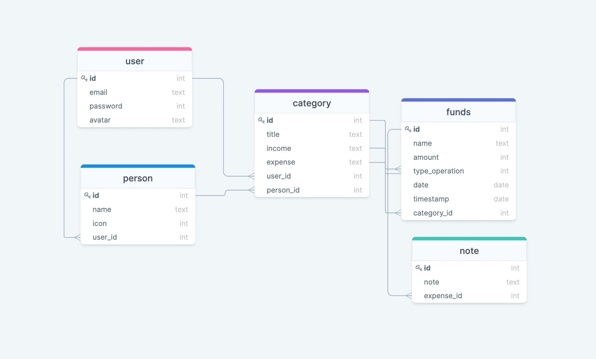

# Personal Budget

The Personal Budget App is going to be helpful to track your expenses and transactions.



## Built With

- Ruby
- Ruby on Rails 
- Postgresql
- Restful API

## Live Demo

[Live Demo link](?)

## Getting Started

To get a local copy up and running follow these simple example steps.

git clone ?

cd Personal-Budget

### Prerequisites
Ruby 3.0.1
Rails 6.1.4.4
PostgresSQL

### Setup
Install gems with:
```
bundle install
```
Setup database with:
```
rails db:create
rails db:migrate
```

### Usage
Start server with:

```
rails server
```

Open http://localhost:3000/ in your browser.

### Run tests

Install rspec with:
```
bundle install
```
and
```
rails generate rspec:install
```
run the test with:
```
rspec spec
```

## Author

👤 **Rustambek**

- GitHub: [@githubhandle](https://github.com/Rustamxon7)
- LinkedIn: [LinkedIn](https://www.linkedin.com/in/rustamjon-tolipov-6a831020b)
- Twitter: [Twitter](https://twitter.com/Rustamjon7777)

## 🤝 Contributing

Contributions, issues, and feature requests are welcome!

Feel free to check the [issues page](?).

## Show your support

Give a ⭐️ if you like this project!

## 📝 License

This project is [MIT](?) licensed.